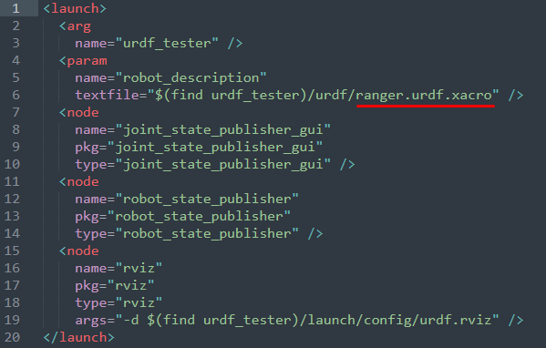
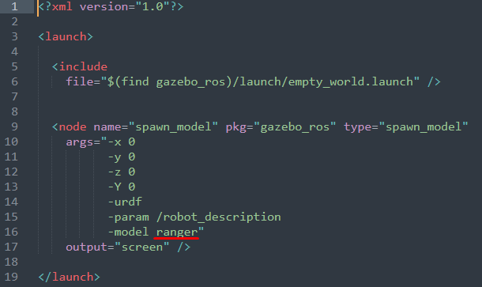

### Old Method

- Rename the urdf file in the folder urdf as *name*.urdf.xacro

- Edit the urdf file as:
  - Change line 6 to the name of your robot *name*
  - Change every filename="" line to include the urdf_tester

 

- Edit the display file in the launch folder
  - Change line 6 to *name*.urdf.xacro

 

- Edit the gazebo file in the launch folder
  - Change line 16 to -model *name*
  

