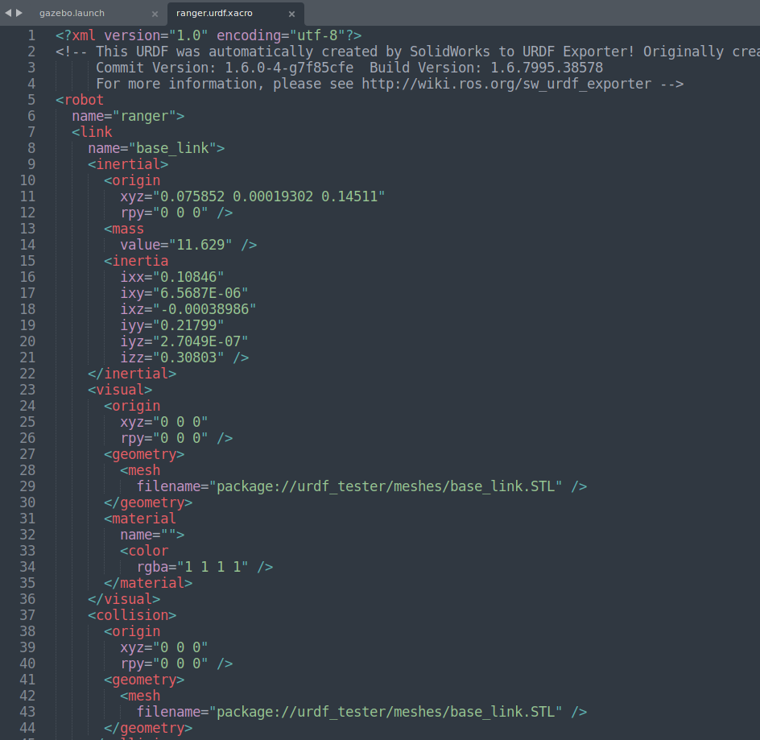
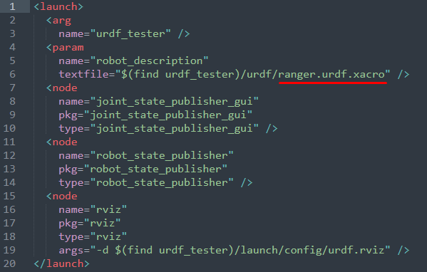
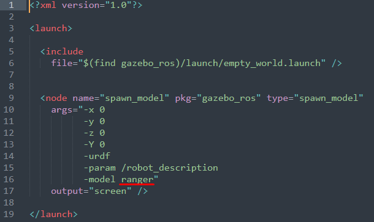

# URDF Tester

Small repository to test urdf files generated by the urdf exporter tool of SolidWorks.

## Example

- First, run RVIZ
```
roslaunch urdf_tester display.launch
```

:warning: <sub> Don't forget that the fixed frame should be the base_link of your robot </sub>

<br />

- Then, in a new window run Gazebo
```
roslaunch urdf_tester gazebo.launch
```


## Instructions
- Clone this repo:
```
git clone git@github.com:mefisto2017/URDF-Exporter-Tester.git
```

- Replace "*config*", "*meshes*" and "*urdf*" folders by the ones generated in Solidworks


- Rename the urdf file in the folder urdf as *name*.urdf.xacro


- Edit the urdf file as:
  - Change line 6 to the name of your robot *name*
  - Change every filename="" line to include the urdf_tester



<br />

- Edit the display file in the launch folder
  - Change line 6 to <name>.urdf.xacro



<br />

- Edit the gazebo file in the launch folder
  - Change line 16 to -model *name*
  


