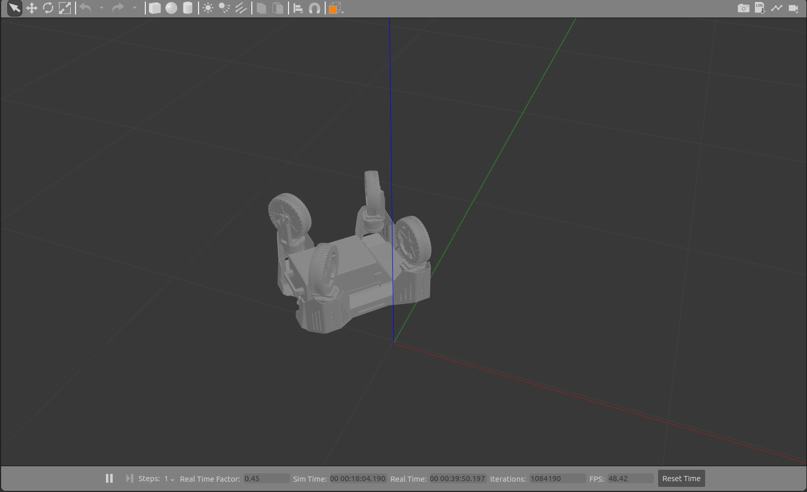

# URDF Tester

Small repository to test urdf files generated by the urdf exporter tool of SolidWorks.

## Usage 

1. Clone this repo:
   ```sh
   git clone git@github.com:mefisto2017/URDF-Exporter-Tester.git
   ```
   
2. Replace **meshes** and **urdf** folders by the ones generated in solidworks

3. Run setup.py script located on the main folder
   ```sh
   cd URDF-Exporter-Tester.git && ./setup.py
   ```
   
4. Compile the package
   ```sh
   catkin_make
   ```
   
5. Source the setup.bash
   ```sh
   source ./devel/setup.bash
   ```
   
6. Run RVIZ
   ```sh
   roslaunch urdf_tester display.launch
   ```

:warning: <sub> Don't forget that the fixed frame should be the base_link of your robot </sub>

<br />

7. Then, in a new window run Gazebo
   ```sh
   roslaunch urdf_tester gazebo.launch
   ```


